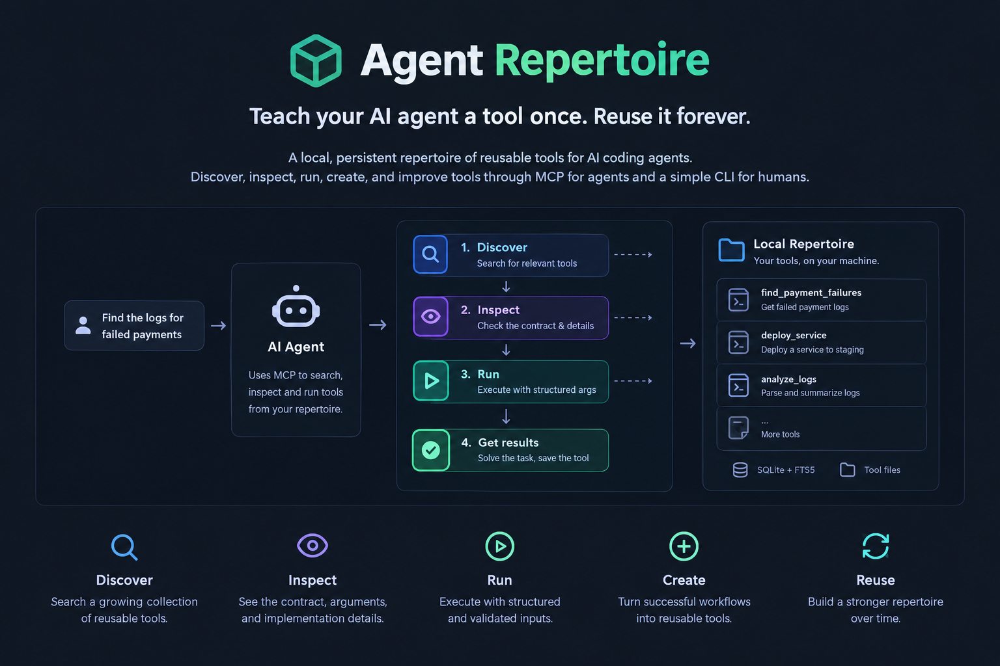

# Agent Repertoire

> **Teach your AI agent a tool once. Reuse it forever.**

Agent Repertoire is a local, persistent repertoire of reusable tools for AI coding agents.



Instead of making an agent rediscover the same multi-step workflow every time, Agent Repertoire lets it **create, search, inspect, run, and improve tools** that persist across sessions.

Works through **MCP for agents** and a simple **`rep` CLI for humans**.

## Why?

AI agents are good at solving problems.

But they often solve the **same problem from scratch**.

A workflow like:

```text
gcloud logging read ...
    ↓
jq ...
    ↓
python ...
    ↓
filter / transform / summarize
```

may work perfectly today — and then be reconstructed from scratch tomorrow.

Agent Repertoire turns successful workflows into reusable tools:

```text
        ┌─────────────────┐
        │   Discover      │
        │   a tool        │
        └────────┬────────┘
                 ↓
        ┌─────────────────┐
        │    Inspect      │
        │   its contract  │
        └────────┬────────┘
                 ↓
        ┌─────────────────┐
        │      Run        │
        │   the workflow  │
        └────────┬────────┘
                 ↓
        ┌─────────────────┐
        │     Create      │
        │   new reusable  │
        │      tools      │
        └────────┬────────┘
                 ↓
           Reuse forever
```

The repertoire lives locally, so your tools stay with you instead of becoming part of a remote service or a giant agent tool list.

---

## Quick start

### 1. Install

```bash
curl -fsSL https://raw.githubusercontent.com/andresdigiovanni/agent-repertoire/main/install.sh | bash
```

The installer downloads the appropriate release binary, verifies its checksum, and installs `rep` into `~/.local/bin`.

### 2. Connect your agent

For Claude Code:

```bash
rep install --target claude
```

For OpenCode:

```bash
rep install --target opencode
```

For Codex:

```bash
rep install --target codex
```

Or configure all three:

```bash
rep install --all
```

Restart your agent session after installation.

### 3. Create a tool

A tool is simply a small, parameterized workflow with a defined contract.

For example:

```yaml
name: find_large_files
description: Find files larger than a given size
language: bash
entrypoint: run.sh

keywords:
  - files
  - disk
  - size
  - cleanup
```

Then:

```bash
rep create --file tool.yaml
```

### 4. Find and run it

```bash
rep search "files"
```

```bash
rep inspect find_large_files
```

```bash
rep run find_large_files size_mb=100
```

That's the basic loop:

```text
search → inspect → run
```

And agents can perform the same operations through MCP.

---

## What Agent Repertoire gives your agent

### 🔎 Discover

Search a growing collection of reusable tools instead of guessing how to perform a workflow from scratch.

```bash
rep search "logs"
```

Search is backed by SQLite + FTS5, so tool metadata remains searchable as the repertoire grows.

### 👀 Inspect

Before executing a tool, inspect its description, arguments, schema, and implementation metadata.

```bash
rep inspect my_tool
```

### ▶️ Run

Execute a tool with structured arguments.

```bash
rep run my_tool key=value
```

Arguments are validated against the tool's JSON Schema before execution.

No shell string concatenation is required.

### 🛠️ Create

Turn a successful workflow into a reusable tool.

Tools can be created by humans through the CLI or by agents through MCP.

### 🔧 Update

Improve an existing tool without creating another one-off workflow.

```bash
rep update ...
```

### 📖 Learn from source

Agents can retrieve the source of an existing tool when they need to understand or modify it.

---

## MCP interface

Agent Repertoire exposes a small, stable MCP surface:

| Tool              | Purpose                         |
| ----------------- | ------------------------------- |
| `search_tools`    | Find reusable tools             |
| `inspect_tool`    | Inspect a tool and its contract |
| `run_tool`        | Execute a tool                  |
| `create_tool`     | Create a new reusable tool      |
| `get_tool_source` | Read a tool's source            |
| `update_tool`     | Modify an existing tool         |

The important idea is that **your entire repertoire does not become a giant list of MCP tools**.

The agent gets a small discovery interface and searches for the capability it needs.

That keeps the agent's available tool surface stable while the repertoire can continue growing.

---

## CLI + MCP

Everything you can do through the CLI is designed around the same underlying repertoire used by agents.

```text
                 Agent Repertoire
                        │
             ┌──────────┴──────────┐
             │                     │
          CLI `rep`              MCP
             │                     │
             └──────────┬──────────┘
                        │
                 Local repertoire
                        │
              ┌─────────┴─────────┐
              │                   │
           SQLite              Tool files
            FTS5              Python / Bash
```

Humans can manage the repertoire directly:

```bash
rep list
rep search "deploy"
rep inspect deploy_service
rep run deploy_service environment=staging
```

Agents can use the same repertoire through MCP.

---

## How tools execute

Tools are intentionally simple.

Each tool has:

1. **Metadata**
2. **A JSON Schema**
3. **An executable entrypoint**
4. **A language/runtime**

Arguments are validated against the schema and provided to the process as JSON on stdin.

Conceptually:

```text
Agent
  │
  │ structured arguments
  ↓
JSON Schema validation
  │
  ↓
Tool process
  │
  │ JSON via stdin
  ↓
Result
```

There is no need to construct shell commands by concatenating untrusted argument strings.

Tools can be implemented using Python or Bash.

---

## Where everything lives

By default, Agent Repertoire stores its data under:

```text
~/.agent-repertoire/
├── repertoire.db
└── tools/
    ├── tool-one/
    ├── tool-two/
    └── ...
```

The database contains tool metadata and the FTS5 search index.

The actual tool implementations remain ordinary files.

You can relocate the data directory with:

```bash
export AGENT_REPERTOIRE_HOME=/path/to/repertoire
```

This is also useful for tests and CI environments.

---

## Agent integration

Agent Repertoire currently supports:

* Claude Code
* OpenCode
* Codex

Installation configures two things:

1. **MCP** — gives the agent access to the repertoire.
2. **Skill** — teaches the agent when it should look for or create reusable tools.

For example:

```bash
rep install --target claude
```

or:

```bash
rep install --all
```

After installation, restart the agent session.

---

## Manual MCP configuration

If you prefer to configure the MCP server yourself, the command is simply:

```text
rep mcp
```

### Claude Code

Add to your MCP configuration:

```json
{
  "mcpServers": {
    "agent-repertoire": {
      "command": "rep",
      "args": ["mcp"]
    }
  }
}
```

### OpenCode

```json
{
  "mcp": {
    "agent-repertoire": {
      "type": "local",
      "command": ["rep", "mcp"],
      "enabled": true
    }
  }
}
```

### Codex

```toml
[mcp_servers.agent-repertoire]
command = "rep"
args = ["mcp"]
```

Or:

```bash
codex mcp add agent-repertoire -- rep mcp
```

---

## A better mental model

Think of Agent Repertoire as a **personal toolbox for your agent**.

Without it:

```text
Task
 ↓
Agent improvises
 ↓
Runs a bunch of commands
 ↓
Gets the result
 ↓
Forgets the workflow
```

With it:

```text
Task
 ↓
Search repertoire
 ↓
Find existing capability
 ↓
Inspect contract
 ↓
Run tool
 ↓
Reuse next time
```

And when the capability doesn't exist:

```text
Task
 ↓
Solve it once
 ↓
Create a tool
 ↓
Store it
 ↓
Reuse it
```

The goal is not to give the agent more tools.

The goal is to give it **better tools over time**.

---

## Requirements

End users need:

* `bash`
* `curl` or `wget`
* `python3`
* `bash`

Python and Bash are used to execute stored tools.

---

## Install a specific version

To install a specific release:

```bash
curl -fsSL https://raw.githubusercontent.com/andresdigiovanni/agent-repertoire/main/install.sh \
  | bash -s -- --version v0.1.0
```

To upgrade, run the installer again:

```bash
curl -fsSL https://raw.githubusercontent.com/andresdigiovanni/agent-repertoire/main/install.sh | bash
```

---

## Uninstall

Remove the agent integrations:

```bash
rep uninstall
```

This removes the Agent Repertoire skill and MCP configuration from supported agents.

Your stored tools remain untouched.

To also delete the local repertoire:

```bash
rep uninstall --all
```

For non-interactive environments:

```bash
rep uninstall --all --yes
```

Finally, remove the binary:

```bash
rm ~/.local/bin/rep
```

---

## Development

Clone the repository:

```bash
git clone https://github.com/andresdigiovanni/agent-repertoire.git
cd agent-repertoire
```

Run the test suite:

```bash
cargo test
```

Install from source:

```bash
cargo install --path .
```

### Requirements for development

* Rust 1.85+
* Cargo

The release binaries are built separately, so end users do not need Rust.

---

## Project structure

```text
agent-repertoire/
├── src/          # Rust implementation
├── tests/        # Test suite
├── skill/        # Agent skill
├── scripts/      # Development / release scripts
├── .github/      # GitHub Actions
├── AGENTS.md     # Agent/development guidance
├── CHANGELOG.md
├── Cargo.toml
└── README.md
```

Additional product and design documentation lives under `docs/`.

---

## Design principles

Agent Repertoire is built around a few simple principles:

### Local first

The repertoire lives on your machine.

### Small agent surface

Agents interact with a small MCP interface instead of receiving every stored tool as a separate MCP tool.

### Structured execution

Tool inputs are defined by JSON Schema and passed as structured JSON.

### Reusable workflows

A workflow that was worth solving once should be cheap to execute again.

### Human-readable tools

Stored tools are ordinary files that humans can inspect, version, debug, and improve.

### Agent-native

Agents can discover and create tools themselves instead of relying exclusively on humans to curate the repertoire.

---

## Contributing

Contributions, ideas, bug reports, and new tool patterns are welcome.

If you find yourself repeatedly asking an agent to perform the same multi-step workflow, that's a good candidate for a reusable repertoire tool.

---

## License

See [LICENSE](LICENSE).
